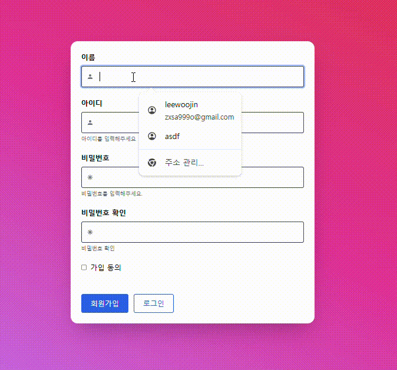
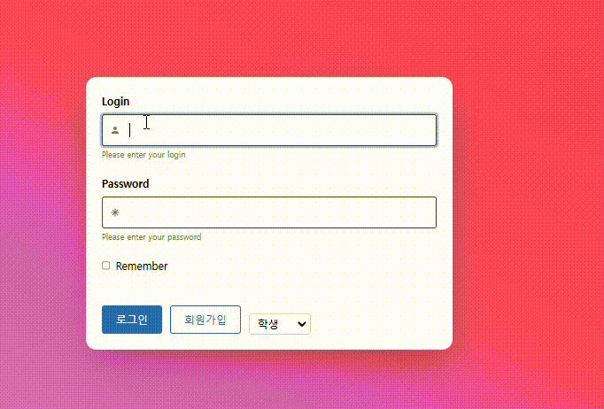
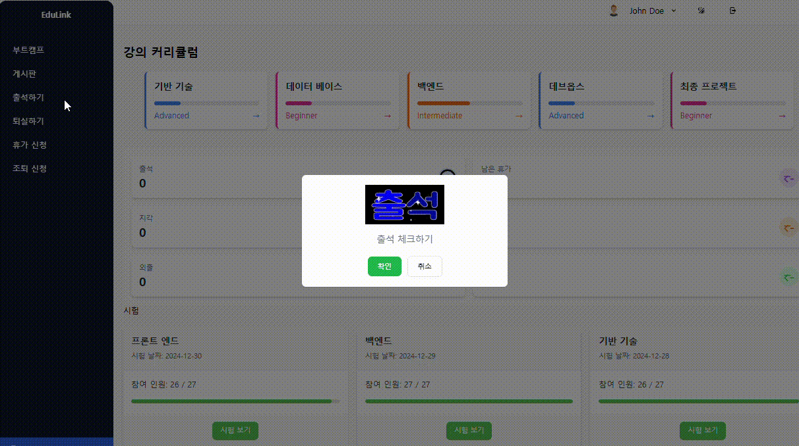
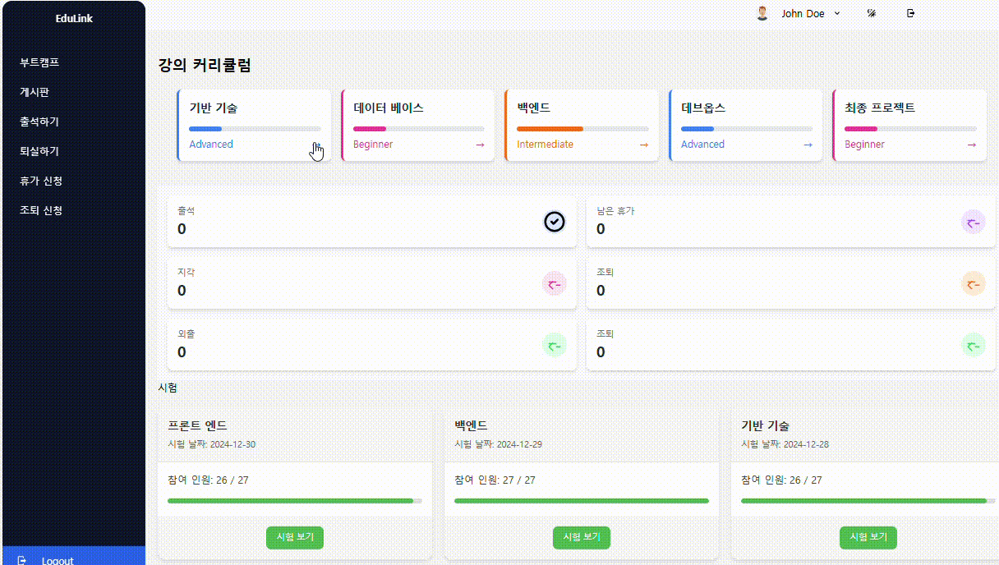
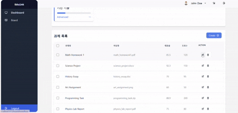
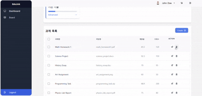
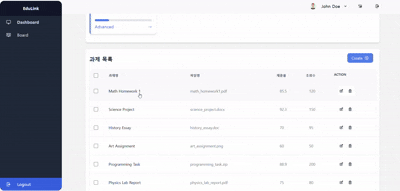
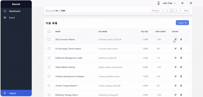
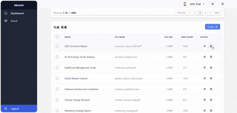
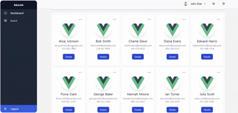

# be12-2nd-404Error-EduLink

# 💡팀

    
    <h3>한화시스템 BEYOND SW캠프 </h3>
    
12기 2차 프로젝트 <strong>팀 404Error</strong>

## 🤚 404Error 팀원

  <table  align="center">
    <tbody>
      <tr>
        <td align="center"><a href="https://github.com/museongkim0" style="text-decoration: none; color: lightgray;"> <b> 🐯 김무성</b></a> </td>
        <td align="center"><a href="https://github.com/kuj7882" style="text-decoration: none; color: lightgray;"> <b> 🐶 김유진</b></a> </td>
        <td align="center"><a href="https://github.com/GoodLeaf" style="text-decoration: none; color: lightgray;"> <b> 🐺 김정엽</b></a> </td>
        <td align="center"><a href="https://github.com/gunha0405" style="text-decoration: none; color: lightgray;"> <b> 🐱 오건하</b></a> </td>
        <td align="center"><a href="https://github.com/leewoojin12" style="text-decoration: none; color: lightgray;"> <b> 🦁 이우진</b></a> </td>
      </tr>
    </tbody>
  </table>

## 📌 프로젝트 주제 

      

### EduLink: 혁신적인 학습 관리 플랫폼
빠르게 증가하는 국비지원 부트캠프 수요에 맞춰 학습 환경의 질적 향상을 목표로 개발된 EduLink는 기존 LMS(HRD-Net)의 한계를 보완합니다.   

이 플랫폼은 단순 출결 확인을 넘어 커리큘럼 관리, 공지사항 통합, 학습 성과 분석 등 다양한 기능을 통해 학습 효율을 극대화합니다.   

수강생들은 EduLink를 통해 학습 전반을 체계적으로 관리하고 편리하게 활용할 수 있습니다.

[상세보기](https://github.com/beyond-sw-camp/be12-1st-404Error-EduLink/blob/main/README.md)

## 🔧 기술 스택
프론트엔드  
 
 
  
<!-- 백엔드  
    
DB   -->
DB 
 
<!--  
   -->
클라우드  
 
<!--    -->
협업 툴  
 

 

## 🖥️ 화면설계서
<a href="https://www.figma.com/design/zYTJiMBo84amcSbHL014bU/%ED%99%94%EB%A9%B4%EC%84%A4%EA%B3%84?node-id=0-1&t=BtJnVvSe2hqNxcLs-1">Figma 화면 설계서</a> 
  

<!-- ## 🔧 시스템 아키텍처
 

 Amazon RDS 

 
- 별도의 설치과정 없이 편리하게 DB를 구성하기 위해 Amazon RDS를 사용했습니다.

 Amazon S3 

- 상품의 썸네일, 상세 이미지 등 상품과 관련된 이미지를 저장하기 위해 S3를 사용하였습니다.

 Backend Server 

- EC2를 이용하여 서버를 배포했습니다.
- 동일한 EC2에 In-Memory 기반의 DB인 Redis 서버를 설치하여 이메일 인증을 빠르게 처리할 수 있도록 하였습니다. 또한, 데이터에 유효 시간(3분)을 설정하여 유효 시간이 지난 데이터는 자동으로 삭제되도록 처리했습니다.

 Frontend Server 

- Frontend Server와 Backend Server는 각각 다른 인스턴스에서 실행되고 있기 때문에 CORS 에러 없이 통신하기 위해서 Proxy Pass 기능이 필요했습니다.
- 이 기능을 위해 EC2에 Nginx를 실행시켰습니다.

 PortOne 

- 상품 결제를 위해 PG사의 결제 대행 서비스 중 하나인 PortOne을 사용하였습니다.

 -->

## ⭐ 접속 주소
[www.edulink.kro.kr](http://www.edulink.kro.kr)

## ✨ 기능 테스트

 User 

### 회원가입

### 로그인

### 개인정보

 Student 

### 출석,퇴실,휴가,조퇴

### 커리큘럼 진행률

 Instructor 

### 커리큘럼 등록

### 과제 생성성

### 과제 수정

### 과제 삭제

### 과제별 제출 학생 확인

### 자료 등록

### 자료 수정

### 자료 삭제

### 학생 상세보기

 Manager 

### 학생 리스트, 상세 정보 보기

### 학생 수강 승인, 제적 처리

### 강사 리스트, 상세 정보 보기

### 강사 추가, 삭제

### 매니저 리스트, 상세보기

### 매니저 추가, 삭제

### 출석 정보 보기

### 휴가 / 병가 / 예비군 출석 처리

### 시험 추가 / 수정

### 시험 상세 정보 보기

 Board  

### 게시판 이동

### 댓글작성

### 게시판 탭이동

### 게시판 글작성

### 기능 이름

